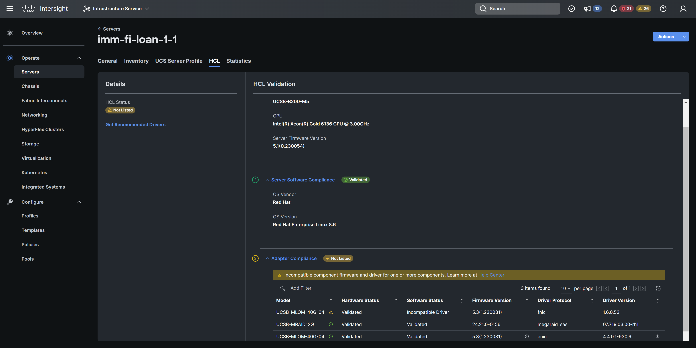

# OS Discovery Tool For Linux

### Description

Intersight OS Discovery Tool that can run on baremetal hosts and populate driver information in Intersight via IPMI.  This tool does **NOT** require any additional connectivity or remote access and behaves similar to ESXi ucs-tools.

_gather_inventory_from_host.sh_ - Creates a yaml file called host-inv.yaml and calls send_inventory_to_imc.sh

_send_inventory_to_imc.sh_  - Reads the host-inv.yaml created by gather_inventory_from_host.sh and writes it to the IMC via IPMI



_ipmitool_ - This project uses the "IPMI Tool" which is a utility for managing and configuring devices that support
the Intelligent Platform Management Interface.  IPMI is an open standard
for monitoring, logging, recovery, inventory, and control of hardware
that is implemented independent of the main CPU, BIOS, and OS.

IPMI Tool Source: [https://github.com/ipmitool/ipmitool](https://github.com/ipmitool/ipmitool)

IPMI Tool License: [https://github.com/ipmitool/ipmitool?tab=License-1-ov-file#readme](https://github.com/ipmitool/ipmitool?tab=License-1-ov-file#readme)

## Table of Contents

- [Installation](#installation)
- [Usage](#usage)
- [Details](#details)

## Installation
**System Requirements:**
Redhat Enterprise Linux, Ubuntu, Rocky Linux, Oracle Linux, SuSE Linux

**Host Software Requirements:**

modinfo, lspci, lshw

Command to install Software Requirements on Rocky Linux and Oracle Linux: `yum install pciutils`

Command to install Software Requirements on SuSE Linux: `zypper install lshw`

Note: Operating System details will be collected even without Host Software Requirements.

**Supported GPU:** Nvidia, AMD

make sure **nvidia-smi, amd-smi** commands are installed and available for GPU support.

## Usage

Confirm all pre-requisite packages are installed

To install on Debain based systems:
- Download the latest debain package from the releases page
- Copy the debain package into the system and run the command ```dpkg -i <os-discovery-tool><version>.deb```

To install on RPM based systems:
- Download the latest rpm package from the releases page
- Copy the rpm package into the system and run the command ```rpm -i <os-discovery-tool><version>.rpm```

A cron job to run at boot and preferably every 24 hours.

Check Host HCL status in Intersight to see populate OS & driver info

## Details

Example host-inv.yaml structure:
```
annotations:
 -kv:
  key: os.updateTimestamp
  value: 2023-04-09T20:42:58-0400
 -kv:
  key: os.kernelVersionString
  value: Red Hat Enterprise Linux 7.9
 -kv:
  key: os.releaseVersionString
  value: 3.10.0-1160.88.1.el7.x86_64
 -kv:
  key: os.type
  value: Linux
 -kv:
  key: os.vendor
  value: Red Hat
 -kv:
  key: os.name
  value: Red Hat Enterprise Linux 7.9
 -kv:
  key: os.arch
  value: x86_64
 -kv:
  key: os.driver.0.name
  value: enic
 -kv:
  key: os.driver.1.name
  value: enic
 -kv:
  key: os.driver.0.version
  value: 2.3.0.53
 -kv:
  key: os.driver.1.version
  value: 2.3.0.53
 -kv:
  key: os.driver.0.description
  value: Cisco Systems Inc VIC 1440 Mezzanine Ethernet NIC
 -kv:
  key: os.driver.1.description
  value: Cisco Systems Inc VIC 1440 Mezzanine Ethernet NIC
 -kv:
  key: os.driver.2.name
  value: fnic
 -kv:
  key: os.driver.2.version
  value: 2.0.0.89-243.0
 -kv:
  key: os.driver.2.description
  value: Cisco MQ FNIC FC
 -kv:
  key: os.driver.3.name
  value: ahci
 -kv:
  key: os.driver.4.name
  value: megaraid_sas
 -kv:
  key: os.driver.3.version
  value: 3.0
 -kv:
  key: os.driver.4.version
  value: 07.719.02.00
 -kv:
  key: os.driver.3.description
  value: Cisco Systems Inc Device 0101
 -kv:
  key: os.driver.4.description
  value: Cisco Systems Inc Device 0124
```

IPMI Command Structure
```
Delete File - 0x36 0x77 0x03 [hex-filename]
  Example Delete host-inv.yaml - ipmitool raw 0x36 0x77 0x03 0x68 0x6f 0x73 0x74 0x2d 0x69 0x6e 0x76 0x2e 0x79 0x61 0x6d 0x6c

Open and Retrieve File Descriptor - 0x36 0x77 0x00 [hex-filename]
  Example Get host-inv.yaml file descriptor - ipmitool raw 0x36 0x77 0x00 0x68 0x6f 0x73 0x74 0x2d 0x69 0x6e 0x76 0x2e 0x79 0x61 0x6d 0x6c
  IPMI will return file descriptor eg 0x08
 
Write Data to File - 0x36 0x77 0x02 [hex-filedescriptor] [hex-payload length] [hex-litle endian starting point in file] [hex-payload]
  Example write 1's (0x31) and 2's (0x32) starting at byte 40 in the host-inv.yaml file - ipmitool raw 0x36 0x77 0x02 0x03 0x14 0x28 0x00 0x00 0x00 0x31 0x31 0x31 0x31 0x31 0x31 0x31 0x31 0x31 0x32 0x32 0x32 0x32 0x32 0x32 0x32 0x32 0x32 0x32 0x0A
  
Close File Descriptor - 0x36 0x77 0x01 [hex-filedescriptor]
  Example close file ipmitool raw 0x36 0x77 0x01 0x08
```
